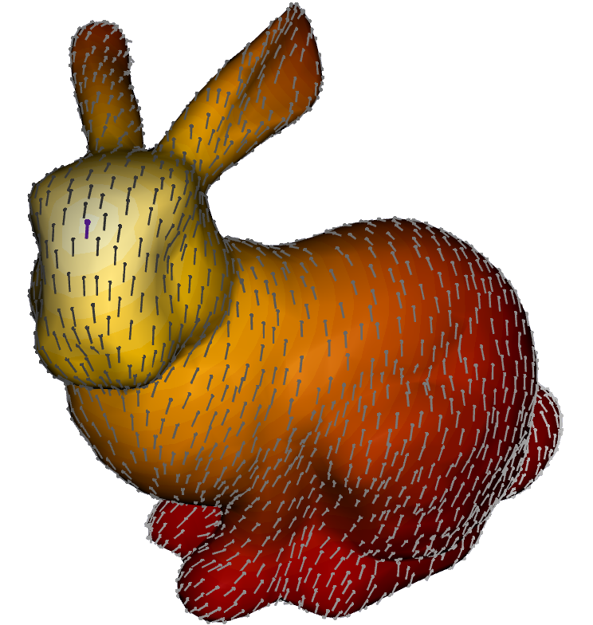
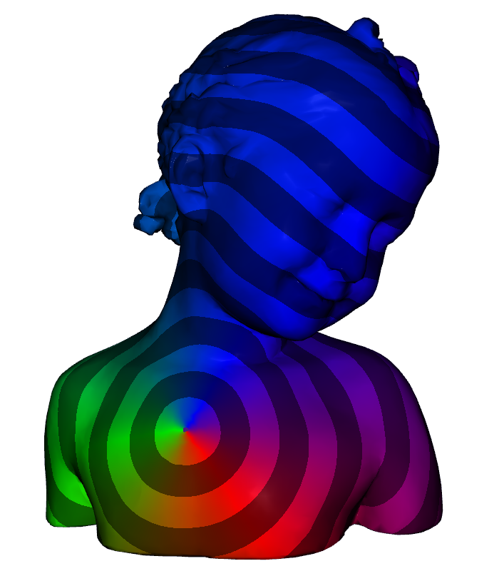

# Vector Heat Method [SSC19]

This is an implementation of the paper Vector Heat Method [SSC19], including the log map computation in the library LIBIGL.




----

## How to build

You can lauch the BASH script `build.sh` to clone LIBIGL and build the project:
```bash
sh build.sh
```
You will be asked if you wish to clone the LIBIGL library. If you don't already have it answer yes (`y` or `Y`). Otherwise you can answer no (`n`). In this case [FindLIBIGL.cmake](FindLIBIGL.cmake) will try to find your LIBIGL include folder. If it don't find it just add the following argument :
```bash
sh build.sh -DLIBIGL_INCLUDE_DIR="<path_to_libigl_folder>/include"
```
with your own LIBIGL folder path.

----

## How to run

Once the `build` folder is created and project built you can enter this folder (it is important to run the executable in this folder, sorry for that) and launch the programm:
```bash
cd build
./vector_heat <a path to a mesh>
```
The argument of the programm is not necessary. If you don't give a path, the bunny will be loaded. When started the programm print all instructions to correctly use it.

----


[SSC19] Nicholas Sharp, Yousuf Soliman, and Keenan Crane. The vector heat method. ACM Trans. Graph., 38(3):24:1–24:19,2019. https://www.cs.cmu.edu/~kmcrane/Projects/VectorHeatMethod/index.html